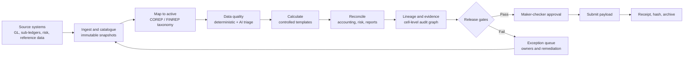

# COREP and FINREP Straight-Through Reporting Architecture

This is a reference architecture for an agentic reporting control plane. It is designed to automate
the reporting lifecycle while keeping regulatory interpretation, material exceptions, and filing approval
under accountable human control. The executable network is
`registries/industry/corep_finrep_stp.hocon`.

## Outcomes

- Produce COREP and FINREP submissions from governed, versioned data snapshots.
- Detect, explain, prioritize, and route data-quality issues before they become filing errors.
- Reconcile accounting, risk, finance, sub-ledger, and regulatory views at the right grain.
- Provide cell-level lineage from source data through mappings, calculations, controls, approvals, and payload.
- Support straight-through processing only when release gates pass and an authorized approver is recorded.

## Operating Model



The controller delegates to seven bounded agents:

1. **Intake and catalogue** registers source ownership, freshness, schema hashes, counts, and control totals.
2. **Regulatory mapping** applies the approved taxonomy and mapping version, including dimensions and sign rules.
3. **Data quality** runs hard rules first and uses AI for anomaly triage, root-cause hypotheses, and repair proposals.
4. **Regulatory calculation** computes report cells with formula and parameter traces.
5. **Reconciliation** explains breaks across GL, sub-ledgers, risk, COREP, and FINREP.
6. **Lineage and evidence** creates the replayable evidence graph and sealed evidence pack.
7. **Approval and submission** enforces maker-checker release and records regulator acknowledgements.

## Non-Negotiable Controls

| Gate | Required evidence | Blocking condition |
| --- | --- | --- |
| Perimeter | Entity, consolidation, currency, reporting date, taxonomy version | Scope or version is ambiguous |
| Source readiness | Snapshot IDs, as-of timestamps, schema hashes, counts, control totals | Source is stale, partial, duplicated, or incompatible |
| Data quality | Rule results, anomaly disposition, completeness and referential checks | Any failed hard rule without approved remediation |
| Calculation | Versioned formulas, parameters, rounding, eliminations, and input traces | Unapproved logic, unexplained estimate, or missing input |
| Reconciliation | Matched balances, tolerance, break classification, owner, disposition | Material or unexplained break |
| Lineage | Source-to-cell links, transformations, actions, timestamps, payload hash | Any material lineage gap |
| Approval | Independent approver, decision, timestamp, evidence-pack hash | No authorized approval or separation-of-duties breach |
| Submission | Submitted payload hash, channel response, acknowledgement, archive ID | No verifiable regulator receipt |

## AI Guardrails

AI is advisory for mapping suggestions, anomaly ranking, break classification, explanations, and
remediation proposals. Deterministic rules remain authoritative for validation and release. Agents must
not overwrite source data, alter a rule or taxonomy, suppress a failed control, fabricate evidence, or
submit without an approval record. Every AI output should include model/version, prompt or policy ID,
confidence, evidence references, and human disposition where it affects a report.

## Canonical Run Record

Persist one immutable run record keyed by `reporting_run_id`, containing:

- reporting date, framework, legal entities, consolidation scope, currency, taxonomy and rule versions;
- source snapshot IDs and hashes, data-quality results, mapping decisions, calculations, and adjustments;
- reconciliation pairs, tolerances, break materiality, owners, and dispositions;
- cell-level lineage references and evidence-pack hash;
- approval identity and timestamp, submitted payload hash, regulator receipt, and archive location.

Use append-only audit events for every agent and human action. Corrections create a new version and never
rewrite the prior run state.

## Exception and Human Workflow

Exceptions are routed by severity: critical filing blockers to the regulatory reporting owner, mapping
ambiguities to the data steward, accounting breaks to finance control, risk breaks to risk control, and
submission or access failures to the operations owner. Each exception has impact, evidence, confidence,
owner, SLA, status, and a re-test requirement. A re-run must show which inputs and outputs changed.

## Deployment Boundaries

The HOCON network is the orchestration and decision-support layer. Production deployment should connect
it to governed storage, a metadata/catalogue service, rule and taxonomy repositories, a calculation engine,
an issue workflow, an append-only audit store, identity and access management, and the approved regulator
submission channel. Credentials, source data, and regulator endpoints must remain outside prompts and
configuration committed to this repository.

## Suggested Implementation Sequence

1. Establish the canonical run record, source catalogue, taxonomy repository, and evidence store.
2. Implement deterministic intake, schema, completeness, and regulatory validation controls.
3. Add COREP and FINREP mappings and calculation traces with replayable test fixtures.
4. Implement accounting, risk, and cross-report reconciliation with approved tolerances.
5. Add AI triage and explanation with confidence thresholds and human disposition.
6. Integrate maker-checker approval, submission, receipt verification, and retention controls.
7. Certify golden runs, negative controls, lineage completeness, access controls, and recovery procedures.

## Confidential-Free Prototype

The reference network includes `synthetic_data_provider`, which returns a deterministic demo snapshot
with no file, database, credential, or external-system dependency. Use this request in the frontend:

```text
Run the synthetic demo COREP and FINREP reporting cycle for 2026-08-31. Use only the built-in synthetic data. Do not use confidential data. Return the run status, controls, reconciliation, lineage, and approval gates.
```

The response should remain clearly labelled `SYNTHETIC_DEMO_ONLY`. The provider is a demonstration
fixture, not a regulatory calculation engine or an approved submission channel.